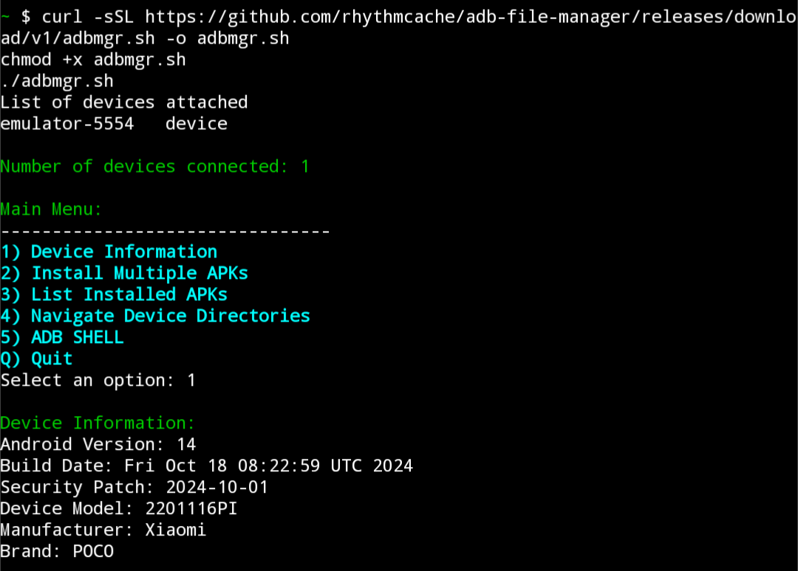
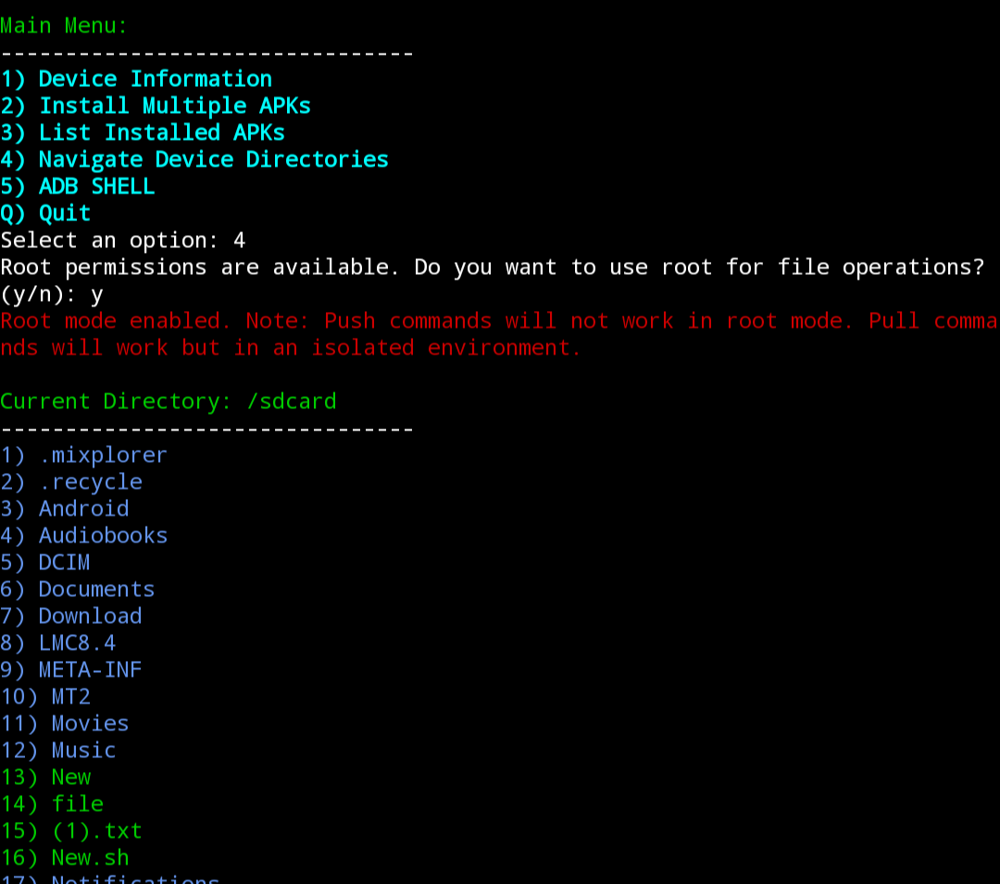
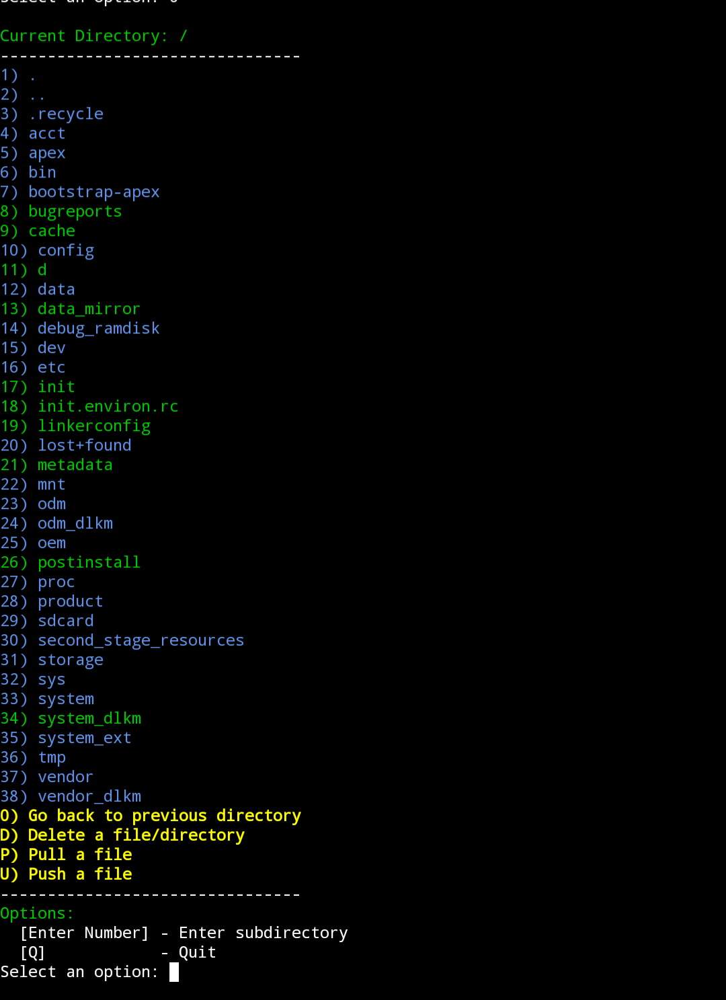
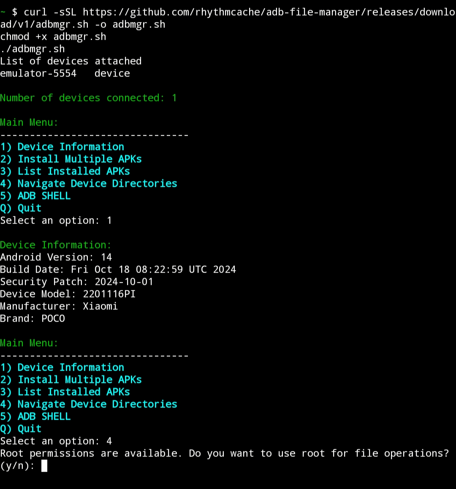

# adb-file-manager

##How to use
- adb should be installed on your distro
- Download the script and run it
or just paste this
```
curl -sSL https://github.com/rhythmcache/adb-file-manager/releases/download/v1/adbmgr.sh -o adbmgr.sh
chmod +x adbmgr.sh
./adbmgr.sh
```
## Bugs
- script  may show 1 device connected even when no devices are connected

## Screenshots
- 1
- 
  
- 2
- 
  
- 3
- 
  
- 4
- 

